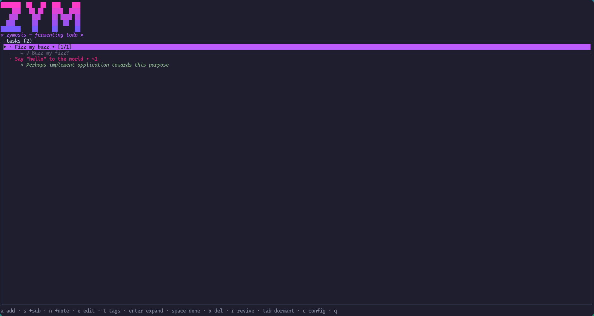

# zymosis (`zym`)

A terminal todo list where tasks "ferment". Instead of rotting in a flat,
ever-growing bog of a `TODO.md`, tasks move through a lifecycle: *hot* when you're
working on them, *decaying* as they go untouched, *dormant* when they drop off
your radar, and *bubbling* back up later so good-but-not-now ideas resurface
instead of being lost.

Heavily inspired by 37signals' [Fizzy](https://www.fizzy.do/). The idea of
letting ideas settle and bubble back up is theirs; this is a small, self-hosted
TUI/CLI take on it.



## The lifecycle

Every task has a *last updated* time. Its state is **derived** from how long it's
been since you touched it, against thresholds you configure:

| State | When | In the UI |
|-------|------|-----------|
| **hot** | recently updated | bright, "breathing", floats to the top |
| **decaying** | left alone a while | colour fades the longer it's ignored |
| **dormant** | ignored long enough | hidden from the main list |
| **bubbling** | dormant even longer | rises back to the top with an animated bubble, so you rediscover it |

Interacting with a task — editing it, ticking a subtask, adding a tag, or
explicitly reviving it — resets it to **hot**. Marking it *done* does not.

## Features

- Add / edit / complete / delete tasks.
- **Subtasks** with a completed/total summary on the parent.
- **Notes**: timestamped details/considerations on a task, so a resurfacing
  bubbling task carries its history with it.
- **Tags / categories** (freeform, e.g. `monitoring`, `perf`, `org`) with tag filtering.
- Time-based **hot / decaying / dormant / bubbling** lifecycle, fully configurable.
- **Revive** dormant tasks, or let bubbling surface them for you.
- **Export / import** to JSON for sharing or backup.
- A **CLI** mirroring every operation, so scripts and agentic tools can drive it.
- A **TUI** with lo-fi juice: a neon-punk block-letter banner, a purple-forward
  palette (swappable via `theme`), a decay colour ramp, gently pulsing hot
  tasks, and animated rising bubbles.

## Install

### Building from source

Requires a Rust toolchain (stable), installable via [rustup](https://rustup.rs/).
Clone the repository and build:

```sh
cargo build --release
# binary at target/release/zym
```

Move that binary to a directory on your `PATH` for easy access.

### Installing from source with Cargo

From the root of the repository:

```sh
cargo install --path .
```

### Verifying the installation

Once installed, confirm the binary is on your `PATH` and runnable:

```sh
zym version
```

This should print something like `zym 0.1.0` (`zym --version` / `zym -V` work
too). If you get "command not found" or a stale version, the binary isn't where
your shell is looking, or an older copy is shadowing the new one.

Data and config live in platform-standard locations (via `dirs`):

- Config: `~/.config/zym/config.toml`
- Tasks:  `~/.local/share/zym/tasks.json`

Saves are atomic (write-temp-then-rename), so a crash mid-write can't corrupt
your list.

## The TUI

Run `zym` with no arguments to launch the interactive interface.

| Key | Action |
|-----|--------|
| `j` / `k` / `↑` / `↓` | move selection |
| `a` | add a task |
| `s` | add a subtask to the current task |
| `n` | add a note to the current task |
| `e` | edit the selected task's title |
| `t` | edit the selected task's tags (space-separated; empty clears all) |
| `Enter` / `→` | expand / collapse subtasks + notes |
| `Space` / `d` | toggle done (task or highlighted subtask) |
| `r` | revive (mark still-relevant → hot) |
| `x` / `Del` | delete (task, or the highlighted subtask/note) |
| `Tab` | show / hide dormant tasks |
| `c` | open the config screen |
| `q` / `Esc` | quit |

While typing (add / subtask / note / edit), the cursor is visible and the line
scrolls to keep it on screen:

| Key | Action |
|-----|--------|
| `Enter` | confirm |
| `Esc` | cancel |
| `←` / `→` | move the cursor |
| `Ctrl+a` / `Home` | jump to line start |
| `Ctrl+e` / `End` | jump to line end |
| `Ctrl+u` | delete from the cursor back to the line start |
| `Backspace` | delete the char before the cursor |
| `Del` | delete the char at the cursor |

### Config screen (`c`)

Edit the lifecycle thresholds and animation rate without leaving the TUI:
`↑`/`↓` select a field, `Enter` edits it (values use the same human spans as the
config file, e.g. `2d`, `36h`), `Enter` again saves, `Esc` backs out. Edits are
validated (same rules as the file) and written straight to
`config.toml`; an invalid value shows an error and keeps your input for a retry.
`storage_path` stays CLI-only, since changing it live would mean reloading the
store.

## The CLI

Every subcommand loads, mutates, and atomically saves the store. `list --json`
and per-task detail are handy for scripting and agentic tools.

```sh
# tasks
zym add "write the report" --note "Q3" --note "clear with legal" --subtask "draft" --tag org
zym list                         # active tasks (hides done + dormant)
zym list --all                   # everything
zym list --status decaying       # filter by lifecycle band
zym list --tag org               # filter by tag
zym list --json                  # machine-readable, includes derived status
zym show 1                       # task detail with indexed subtasks, notes + tags
zym done 1                       # mark complete
zym edit 1 --title "..."
zym revive 1                     # still-relevant → hot
zym rm 1

# subtasks (index is 1-based, as shown by `zym show`)
zym subtask add 1 "review with team"
zym subtask done 1 2
zym subtask rm 1 2

# notes (index is 1-based, as shown by `zym show`)
zym note add 1 "check the p99, not the mean"
zym note rm 1 2

# tags / categories (freeform, normalised to lowercase)
zym tag add 1 monitoring
zym tag rm 1 monitoring

# data
zym export tasks-backup.json
zym import tasks-backup.json     # appends; ids are reassigned

# config
zym config                       # show resolved config + paths
zym config --init                # write the default config file
zym config --json

# misc
zym version                      # print version (also --version / -V)
```

Run `zym <command> --help` for details on any subcommand.

## Configuration

`~/.config/zym/config.toml` — any missing field falls back to its default, so
you only write what you want to change. Durations are human-readable spans
(`s`/`m`/`h`/`d`/`w`).

```toml
hot_window    = "2d"     # newer than this → hot
dormant_after = "2w"     # older than this → dormant (hidden)
bubble_after  = "30d"    # dormant this much longer → bubbling
storage_path  = "/home/you/.local/share/zym/tasks.json"
tick_fps      = 12        # TUI animation cap
theme         = "neon_purple"  # color theme; also: "neon_teal"
```

`hot_window` must be `<= dormant_after`; the app validates this on load. An
unknown `theme` name falls back to the default, so the file always loads.

Everything here except `storage_path` is also editable in the TUI's config
screen (press `c`) — see [The TUI](#the-tui).

## Built with

- [Ratatui](https://ratatui.rs/) — terminal UI
- [Serde](https://serde.rs/) + [serde_json](https://github.com/serde-rs/json) — serialization / storage
- [clap](https://github.com/clap-rs/clap) — CLI parsing
- [toml](https://github.com/toml-rs/toml) — config
- [dirs](https://github.com/dirs-dev/directories-rs) — platform paths
- [proptest](https://github.com/proptest-rs/proptest) — property-based tests

## Credits

The core idea of a task tracker which mirrors how tasks' life-cycle actually tends to be, is inspired by **37signals' Fizzy**. Everything
here is an independent TUI reimagining of that concept.

## Known limitations / roadmap

- The CLI `list` sorts by recency; the TUI additionally floats hot/bubbling to
  the top.
- Tags are freeform — no typo protection (`perf` and `performance` are distinct).
- Storage is a JSON file. SQLite may come later if a feature needs it.

## AI Usage Disclosure
This project was developed leveraging agentic coding assistants, to amplify the speed of development. The primary model used was Claude Opus 4.8, through the Pi agentic harness.
